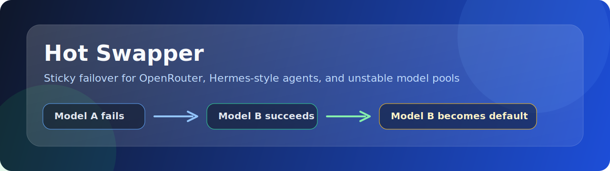
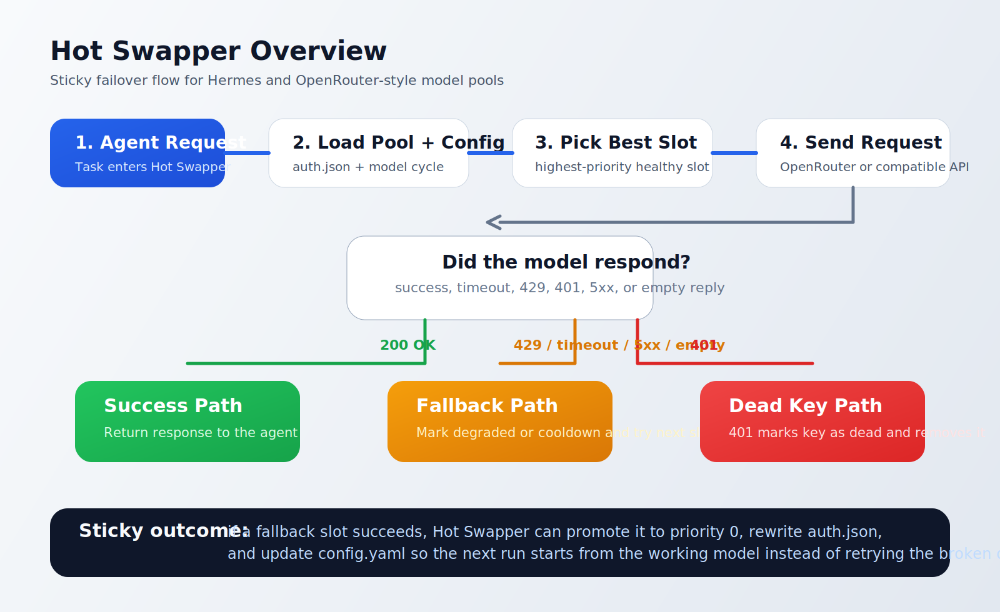

# Hot Swapper



Hot-swap failing LLM routes to healthy fallbacks for OpenRouter and agent runtimes.


Hot Swapper is a small failover layer extracted from a working Hermes setup and packaged as a generic sidecar for multi-model gateways and agent runtimes. It watches a credential pool, moves away from failing model routes, and promotes the successful fallback model to the new default.

That last part is the point: after a swap works, the next run starts from the model that actually responded instead of retrying the same broken default again.

## Why

OpenRouter is powerful because it gives access to many model routes from one place, including free, preview, and budget-friendly options. Those routes can also be noisy in real use: a model may timeout, return no content, hit a rate limit, or temporarily stop responding.

Hot Swapper is built for that daily workflow: keep the agent moving, switch to a healthy fallback, and remember what worked.

Hot Swapper helps when:

- you use OpenRouter free, preview, or limited routes
- you use other multi-model gateways or agent runtimes with similar failures
- you want a fallback chain for unstable or overloaded models
- a failed model should not block the whole agent
- the working fallback should become the new default automatically

## Recommended For

Hot Swapper is a good fit for OpenRouter-style gateways that expose many different models behind one API. It is useful when a route occasionally returns `429`, `503`, a timeout, a provider disconnect, or no content.

OpenRouter already supports routing and fallback features, but Hot Swapper adds local persistence for agent projects: when a fallback model works, it can become the next default in your own local config.

## How It Works



1. The agent request starts with the highest-priority healthy slot.
2. If the model responds, the response is returned.
3. If the model fails, the slot is marked as degraded, cooldown, or dead.
4. The request moves to the next available slot.
5. If a fallback succeeds, sticky swap can promote it to priority `0`.
6. `auth.json` and optionally `config.yaml` are updated so the next run starts from the winner.

## What It Handles

- timeout, `5xx`, and empty response failover
- `429` cooldown
- `401` dead key detection
- periodic health checks for degraded slots
- sticky priority persistence in `auth.json`
- optional `model.default` persistence in `config.yaml`

## Install

Install dependencies:

```bash
pip install -r requirements.txt
```

Install into a Hermes home:

```bash
python install_into_hermes.py --hermes-home %LOCALAPPDATA%\.openworld\hermes
```

You can also write the initial model cycle during install:

```bash
python install_into_hermes.py --hermes-home %LOCALAPPDATA%\.openworld\hermes --models "provider/primary-model,provider/fallback-model,provider/reserve-model"
```

Then edit:

```text
<hermes-home>\swapper\hot_swapper.config.json
```

Full install notes: [INSTALL.md](./INSTALL.md)

## Configure Models

Put the model rotation in `hot_swapper.config.json`:

```json
{
  "provider_pool": "openrouter",
  "model_cycle": [
    "provider/primary-model",
    "provider/fallback-model",
    "provider/reserve-model"
  ],
  "sticky_swap": true,
  "persist_auth_priority": true,
  "persist_config_default": true
}
```

The provider pool is read from Hermes `auth.json`, usually:

```json
{
  "credential_pool": {
    "openrouter": [
      {
        "id": "slot_1",
        "priority": 0,
        "access_token": "sk-or-v1-REPLACE_ME",
        "base_url": "https://openrouter.ai/api/v1"
      }
    ]
  }
}
```

Never commit real keys. Use [examples/auth.template.json](./examples/auth.template.json) only as a shape reference.

## Run

Show slot status:

```bash
cd C:\path\to\hermes\swapper
python swapper.py status --hermes-home C:\path\to\hermes
```

Check every slot:

```bash
python swapper.py check --hermes-home C:\path\to\hermes
```

Run a real test request:

```bash
python swapper.py test --hermes-home C:\path\to\hermes
```

## AI-Assisted Install

If you want a coding agent to install this into another project, give it:

- [AI_INSTALL.md](./AI_INSTALL.md)

That file explains where to put the runtime, where keys belong, where models belong, and what should be validated.

## Repository Layout

```text
llm-hot-swapper/
  assets/
  examples/
  hot_swapper.py
  hot_swapper.config.example.json
  install_into_hermes.py
  INSTALL.md
  AI_INSTALL.md
  README.md
  LICENSE
  requirements.txt
```

## Notes

Hot Swapper installs as a sidecar for Hermes-style projects. It does not automatically inject secrets and does not blindly patch a project runtime. That keeps installation predictable: keys stay in `auth.json`, model rotation stays in `hot_swapper.config.json`, and the swapper updates only the files it is designed to update.

Hot Swapper is an independent community project. It is not an official Hermes or OpenRouter package.

## License

MIT
